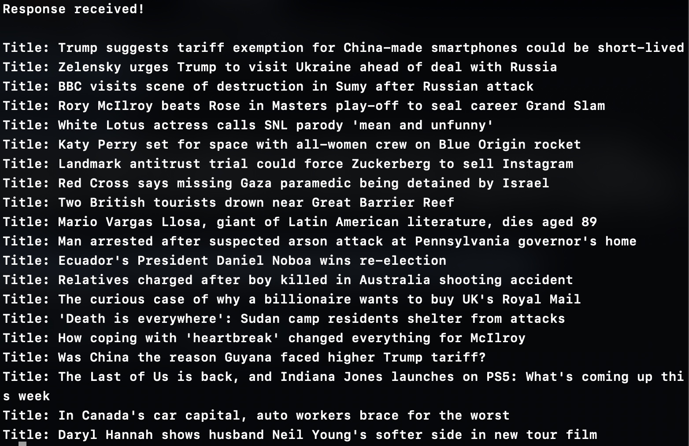

# C++ BBC News Scraper

This beginner project scrapes headlines from the BBC News homepage using `libcurl` and `std::regex`.



## What it does
- Sends an HTTP request to [`https://bbc.com/news`](https://www.bbc.com/news)
- Saves the websites structure as a txt file
- Extracts headline titles using regular expressions
- Filters out short or irrelevant titles (e.g. "News", "Sport")
- Prints valid headlines to the terminal

## Technologies Used
- C++
- libcurl
- Regular Expressions

## Why I built this
I used this to get hands-on practice with web scraping.

## Problems with the code
- Hardly applicable to other websites as many websites block the use of web scrapers
- infinite loop bug after running
- using regex makes it harder to expand upon the code. You should probably switch to a proper HTML parser

## Expanding the code
- The code can be expanded by adding more regex patterns in the main function-
to do this just inspect the websites structure (txt file) and search for keywords
like lastUpdated. To find the position of those keywords, search for a news title


## How to run
1. Make sure [libcurl](https://github.com/curl/curl) is installed.
2. Compile the code:
```bash
g++ -std=c++11 main.cpp -o scraper -lcurl